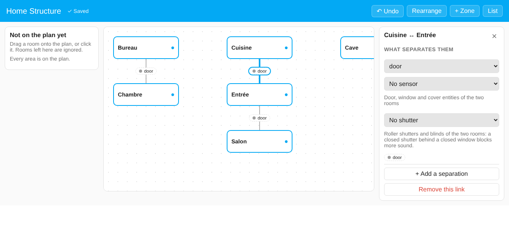
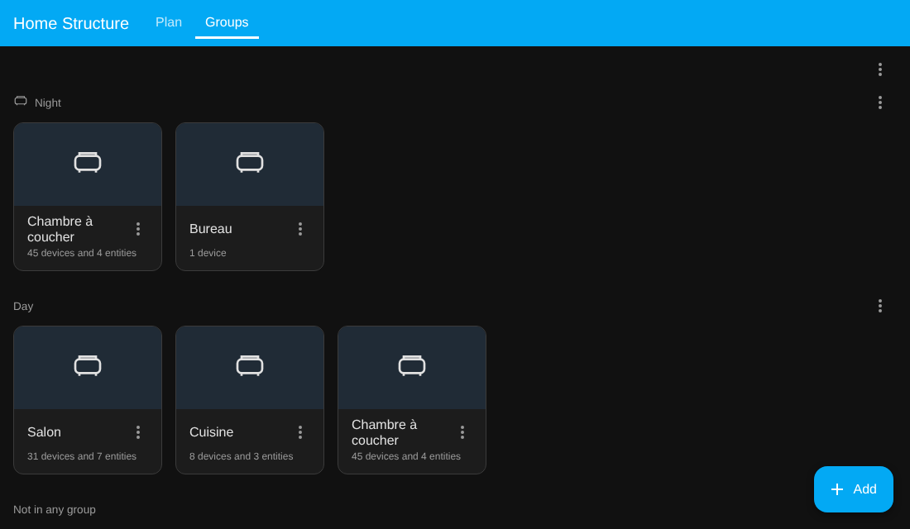

# Home Structure

Une intégration Home Assistant qui décrit **la structure de votre logement** : quels espaces sont voisins, ce qui les sépare (espace ouvert, ouverture sans porte, porte, porte vitrée, fenêtre, volet, mur plein) et ce que disent les capteurs d'ouverture à l'instant.

Elle ne fait rien du son, de la lumière, de la chaleur ni de la présence. Elle garde seulement la description du logement, pour que n'importe quelle intégration ou automatisation puisse demander « le salon est-il ouvert sur l'entrée ? » au lieu que chacune vous demande de décrire votre logement. [Sound Recognition](https://github.com/schawki/sound-recognition-ha) est la première à s'en servir.



*English: [README](../README.md)*

## Installation

Nécessite Home Assistant 2025.8 ou plus récent et vos pièces définies comme pièces (areas).

1. HACS → Dépôts personnalisés → `https://github.com/schawki/ha-home-structure` (catégorie : Intégration) → installer, redémarrer Home Assistant.
2. Paramètres → Appareils et services → Ajouter une intégration → **Home Structure**.
3. Cliquez sur **Configurer** pour décrire votre logement.

## Le modèle

- **Espaces.** Une pièce est une pièce (area) Home Assistant. Une **zone** est un espace qui n'est pas une pièce ordinaire, et elle peut être :
  - *dans votre logement* : jardin, balcon, terrasse, cour, garage ;
  - *en dehors* : hall ou palier, cage d'escalier, partie commune de l'immeuble, rue, logement voisin.

  Si une zone existe déjà comme pièce Home Assistant (un jardin avec une caméra, un hall d'immeuble avec une sonnette), vous donnez un type à cette pièce et indiquez si elle fait partie du logement ; ses appareils restent en place. Les zones sans pièce (la rue, le voisin) sont créées dans Home Structure.
- **Types de pièce.** Une pièce ordinaire peut recevoir un type, choisi par vous et jamais deviné d'après son nom : organisé en groupes : dormir (chambre, chambre parentale, chambre d'enfant, chambre de bébé, chambre d'amis), vie et loisirs (salon, salle à manger, salle de jeux, salle de cinéma, salle de sport), travail (bureau, atelier), salles d'eau (salle de bains, toilettes), cuisine et services (cuisine, cellier, buanderie, local technique, dressing, rangement, cave, grenier) et circulation (couloir, entrée, escalier). Un garage est un type de zone. Un type publié n'est jamais retiré. C'est facultatif, et seules les pièces en ont un. Les intégrations le lisent sous le nom `room_type` pour s'adapter à l'usage d'une pièce.
- **Liaisons.** Deux espaces voisins sont reliés. Deux espaces sans liaison ne sont pas adjacents.
- **Séparations.** Une liaison a une ou plusieurs séparations, chacune d'un type :

  | Type | Sens | État |
  |---|---|---|
  | `open_space` (espace ouvert) | aucune séparation (un salon et une entrée en un seul espace) | toujours ouvert |
  | `opening` (ouverture) | un passage sans porte | toujours ouvert |
  | `door` (porte) | une porte | selon son capteur |
  | `glass_door` (porte vitrée) | porte vitrée ou coulissante | selon son capteur |
  | `grille` (grille / porte grillagée) | grille de sécurité ou porte grillagée : une barrière physique qui n'arrête presque pas le son | selon son capteur s'il y en a un |
  | `window` (fenêtre) | une fenêtre | selon son capteur |
  | `shutter` (volet) | volet roulant ou store | selon son volet (cover) |
  | `wall` (mur) | un mur plein : adjacent, sans passage | toujours fermé |

  Une porte et une porte vitrée entre les deux mêmes espaces sont deux séparations d'une seule liaison.
- **Capteurs.** Une séparation qui peut changer peut avoir un `binary_sensor` (contact de porte ou de fenêtre) ou un `cover` (volet). Son état devient `open`, `closed`, `partial` (un volet entre 1 et 99 %, ou en mouvement) ou `unknown` (pas de capteur, ou il ne répond pas).
- **Un volet devant une fenêtre ou une porte.** Une porte, une porte vitrée ou une fenêtre peut aussi indiquer le `cover` du volet roulant ou du store placé devant elle (champ `shutter`). La séparation garde son propre état et signale le volet à côté, dans les attributs `shutter`, `shutter_state` et `shutter_position` : un consommateur peut combiner les deux. Le type `shutter` seul ne sert que pour un volet qui est toute la séparation.

## Configuration

Ouvrez **Home Structure** dans la barre latérale. Vous voyez un plan que vous organisez vous-même ; tout ce que vous faites est enregistré immédiatement et annulable :

1. **Ajouter vos pièces.** La colonne de gauche liste les pièces Home Assistant qui ne sont pas encore sur le plan. Cliquez sur **Tout ajouter** (elles sont rangées en une colonne par étage, que vous déplacez ensuite), ou glissez ou cliquez seulement celles que vous voulez. Les pièces laissées dans la colonne sont ignorées. Rien n'est deviné d'après les noms.
2. **Les déplacer** où vous voulez, pour que le plan ressemble à votre logement. **Réorganiser** remet tout en ordre par étage.
3. **Les relier.** Glissez la poignée ● d'une pièce sur la pièce voisine. Cliquez sur le lien pour dire ce qui les sépare (espace ouvert, porte, porte vitrée, grille, fenêtre, volet, mur…), choisissez le capteur d'ouverture parmi les portes, fenêtres et volets des deux pièces, choisissez le volet placé devant une fenêtre ou une porte s'il y en a un, et ajoutez une deuxième séparation s'il y en a une autre. Le lien affiche l'état en direct de chaque séparation (ouvert, fermé, partiel).
4. **Donner son type à chaque pièce** dans son panneau (chambre, chambre de bébé, salle de sport, dressing…), ou ne rien préciser. Une seule liste couvre les pièces et les espaces extérieurs.
5. **Ajouter l'extérieur** avec **+ Zone** : jardin, balcon, hall, cage d'escalier, rue, logement voisin… Le type décide si la zone fait partie du logement ; modifiable. Une pièce peut aussi devenir un type de zone (une pièce « Garage » peut être marquée garage), et une pièce peut être scindée en créant une zone à côté.

Sur un écran étroit, le plan devient une liste avec les mêmes possibilités. Les anciens écrans (*Configurer* sur l'intégration) fonctionnent toujours et modifient les mêmes données.

## Groupes de pièces

L'onglet **Groupes** du panneau réunit des pièces en groupes à vous : les chambres, la partie nuit du logement, les pièces côté rue… Home Assistant ne regroupe les pièces que par étage ; un groupe n'a pas cette limite, donc **une pièce peut être dans plusieurs groupes** (ou dans aucun), et rien n'est deviné d'après les noms.



- La page fonctionne comme la page Pièces de Home Assistant : une section par groupe avec une carte par pièce (son icône, son nom et ce qu'elle contient, comme sur cette page), **+ Ajouter** en bas à droite pour créer un groupe, et un menu ⋮ sur chaque groupe (**Réorganiser les pièces**, **Modifier le groupe**, **Supprimer le groupe**). Le menu ⋮ du haut réorganise les groupes eux-mêmes. La réorganisation se fait en **glissant** (une carte dans son groupe, un groupe par son en-tête ; cela marche aussi au doigt, Échap ou un relâchement à l'extérieur annule, et les touches fléchées déplacent une poignée qui a le focus). L'ordre choisi est conservé.
- Le menu ⋮ d'une carte de pièce permet de la **déplacer vers un autre groupe**, de l'**ajouter à un autre groupe**, de la **retirer de ce groupe** ou **de tous les groupes**. Les pièces sans groupe sont listées en bas.
- **Modifier le groupe** contient un ID (fixé à la création, jamais modifié), un nom, une icône, les pièces (pastilles, avec **Ajouter une pièce**), des alias et un *niveau* (conservé, sans effet pour l'instant). Les alias sont d'autres noms pour vos propres modèles et scripts : ils figurent dans le service et les attributs ci-dessous ; Assist ne les lit pas.
- **Température et humidité.** Pour chacune, choisissez *Aucun capteur*, *Un seul capteur* (parmi ceux des pièces du groupe), *Moyenne de tous les capteurs des pièces* ou *Moyenne d'une sélection*. Les entités de diagnostic et de configuration ne sont jamais proposées, et la fenêtre montre chaque source avec sa valeur. « Tous » est recalculé à chaque fois : un capteur déplacé vers ou depuis ces pièces est suivi automatiquement. Modifier un groupe ne recharge jamais l'intégration : ses capteurs sont mis à jour sur place. Un groupe avec un capteur reçoit une entité `sensor` (par exemple `sensor.home_structure_night_temperature`) avec les attributs `group`, `mode`, `area_ids`, `sources` et `used_sources`. Une source indisponible, non numérique ou absurde (une humidité supérieure à 100 %) est ignorée au lieu d'être comptée comme zéro ; les sources en Fahrenheit ou en Kelvin sont converties. Si une pièce quitte un groupe, les capteurs qui ne sont plus dans les pièces du groupe sont retirés de ses réglages et le panneau vous le dit.
- Un groupe peut être vide, et supprimer un groupe ne touche jamais à ses pièces.

Utilisez les pièces d'un groupe partout où Home Assistant accepte une pièce, en lisant la liste avec le service :

```yaml
actions:
  - action: home_structure.get_groups
    response_variable: result
  - action: light.turn_off
    target:
      area_id: "{{ (result.groups | selectattr('id', 'eq', 'night') | first).area_ids }}"
```

Qu'un appareil sache agir sur des pièces dépend de l'appareil et de son intégration (un aspirateur qui nettoie par pièce, par exemple, dépend de ce que son intégration propose) ; Home Structure fournit seulement la liste des pièces.

Les étiquettes de Home Assistant donnent aussi plusieurs appartenances et peuvent être ciblées, mais elles s'appliquent à n'importe quoi. Les groupes ne contiennent que des pièces, se présentent comme des étages, et peuvent donner une température et une humidité pour tout le groupe.

## Ce que vous obtenez

- **Un capteur par séparation**, avec l'état ouvert, fermé ou partiel (inconnu quand il ne peut pas être lu) et les attributs `type`, `space_a`, `space_b`, `name_a`, `name_b`, `sensor` et `position`. Utilisable dans les automatisations, les modèles et les tableaux de bord.
- **Un service** `home_structure.get_structure`, qui renvoie toute la structure avec les états actuels, pour les intégrations (exemple complet de la réponse dans le [README anglais](../README.md)).
- **Un service** `home_structure.get_groups`, qui renvoie les groupes de pièces : `id`, `name`, `level`, `icon`, `aliases`, `area_ids`, `areas` (id et nom) et, pour `temperature` et `humidity`, le `mode`, les `entities` choisies et l'`entity_id` du capteur du groupe (nul sans capteur).

## Dans une automatisation

Chaque séparation est un capteur : l'état d'une porte entre deux pièces est disponible comme n'importe quelle entité :

```yaml
triggers:
  - trigger: state
    entity_id: sensor.home_structure_living_room_building_hall_door
    to: open
actions:
  - action: notify.mobile_app_phone
    data: {message: "La porte du hall est ouverte."}
```

## Utilisée par Sound Recognition

[Sound Recognition](https://github.com/schawki/sound-recognition-ha) lit la structure pour savoir combien un son passe d'une pièce à l'autre (une porte ouverte le laisse passer, une porte ou un volet fermé l'étouffe, un mur l'arrête presque) et pour inclure les appareils des pièces reliées. C'est facultatif pour Sound Recognition, et Home Structure n'en a pas besoin.

## Dépannage

- *Une pièce n'apparaît pas dans la liste de gauche* : ce n'est pas encore une pièce Home Assistant, ou elle est déjà sur le plan.
- *Une séparation affiche `unknown`* : elle n'a pas de capteur, ou son capteur est indisponible. Les portes et fenêtres sans capteur restent `unknown` ; seuls les espaces ouverts, ouvertures et murs ont un état fixe.
- *Le capteur d'une séparation n'est pas dans la liste* : seules les entités porte, fenêtre et volet des deux pièces sont proposées ; affectez d'abord l'entité à la bonne pièce.
- *Tout semble faux après un changement* : utilisez **Annuler** dans le panneau ; chaque changement est enregistré tout de suite et annulable.

## Langues

L'anglais est la référence, le français est inclus. Pour ajouter une langue, voir [CONTRIBUTING.md](../CONTRIBUTING.md) : un seul fichier à copier et traduire.

## État du projet

Version 0.7, testée (les tests du backend et du panneau tournent à chaque commit) et utilisée avec Sound Recognition. Le logement se décrit dans le panneau **Home Structure** de la barre latérale (un plan que vous organisez, avec enregistrement automatique et annulation) ; les menus *Configurer* de l'intégration restent en secours. Les groupes de pièces sont dans l'onglet **Groupes**. Retours et tickets bienvenus.

## Licence

MIT.
